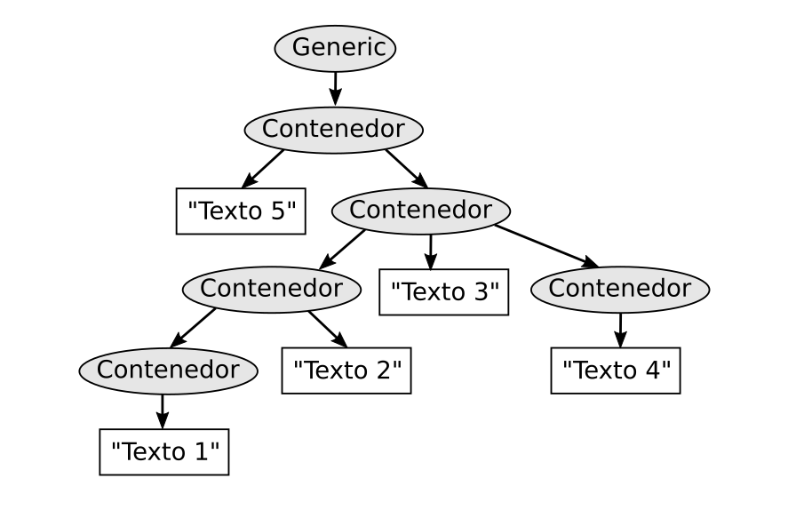

    a) Escribe el documento en SGML que representa esa estructura
    b) ¿Cuantos elementos hay en total?
    c) ¿Cuantos elementos terminales hay?. Indica sus valores
    d) ¿Cuantos elementos no terminales hay?. Indica cuántos hay en cada nivel
    e) ¿Cuantos elementos hay en el nivel 5?.Indica sus nombres
